### Lab Report

#### 高健翔 521021910197 <wushaoxiangg123@sjtu.edu.cn>


1. 包的设计  
- 发包(sender)
    ```
    前4个bytes表示checksum, 后面三个bytes表示seq number, 之后的一个byte表示负载大小, 最后是负载.
    ----------------------------------------------|
    |   4B   |  3B   | 1B |    120B               |
    |<------>|<----->|<-->|<--------------------->|
    | cksum  |  seq  | sz |       payload         |
    |---------------------------------------------|
    ```
- 收包(reveiver) 需要将ACK信息组包发送至sender
    ```
    前4个为checksum, 之后三个bytes为seq number, 之后全用0覆盖
    |---------------------------------------------|
    |   4B   |  3B   |      all is 0              |
    |<------>|<----->|<-------------------------->|
    | cksum  |  seq  |                            |
    |---------------------------------------------|
    ```  
- seq number的设定 用三个bytes表示
    ``` C++
      pkt.data[seq_offset] = (unsigned char)(seq_ / (256 * 256));
      pkt.data[seq_offset + 1] = (unsigned char)((seq_ / 256) % 256);
      pkt.data[seq_offset + 2] = (unsigned char)(seq_ % 256);
      /*这是拼凑seq number的细节实现, 一个byte有8个bit, 表示0-255, 故使用256进制表示, 注意应当是无符号的*/
    ```
- checksum的计算
    ``` C++
    /*仿照tcp checksum的方式进行实现*/
    /*忽略前面checksum的位置, 每两个bytes切割成一个short类型的数, 逐个相加, 结果取反*/
    /*个人原因 为了8bytes对齐, 强行将checksum结果由short无符号扩展为u_int32_t*/
    static short checksum(struct packet *pkt) {
        long sum = 0;
        unsigned short *pointer = (unsigned short *)(pkt->data);
        for (u_int32_t begin = 4; begin < RDT_PKTSIZE; begin += 2) {
            pointer = (unsigned short *)(&(pkt->data[begin]));
            sum += *pointer;
        }
        while (sum >> 16) {
            sum = (sum & 0xffff) + (sum >> 16);
        }
        return ~sum;
    }
    ```

2. 参数设置
   ``` C++
    /*init window size & idx : start and end*/
    static const u_int32_t window_size = 10;
    u_int32_t window_start_idx = 0;
    u_int32_t window_end_idx = 9;

    /*timeout*/
    static const double time_out = 0.3;

    /*packet settings*/
    static const u_int32_t payload_size_bytes = 1;
    static const u_int32_t seq_bytes = 3;
    static const u_int32_t checksum_bytes = 4;
    static const u_int32_t payload_bytes = RDT_PKTSIZE - checksum_bytes - payload_size_bytes - seq_bytes;

    static const u_int32_t payload_size_offset = 7;
    static const u_int32_t seq_offset = 4;
    static const u_int32_t checksum_offset = 0;
    static const u_int32_t payload_offset = 8;

    /*max seq sender has sent*/
    u_int32_t mx_send = 0;

    /*sender buffer*/
    std::vector<struct packet> pkt_q;

    /*acknum packet offset*/
    static const u_int32_t ack_offset = 4;
   ```

3. 收发包机制
- 采用GBN协议  
  - Sender端  
      - 接收到上层message时, 将其切成小的packet存入buffer里面, 当第一次接收到上层的消息时, 启用滑动窗口, 开始向下层发送packet
      - 接收到下层返回的包时, 核对seq和checksum, 如果seq比滑动窗口的起点还大, 那么便可以将窗口移动到seq的位置
      - 如果出现超时情况, 那么将本次窗口内的包全部重新发送 -- 注意当进入窗口发送时才启动计时器, 有的时候当窗口内没有包(即不进入循环发送的阶段)且启动计时器后会导致无限的timeout  
  - Receiver端
      - 起初采用接收端滑动窗口大小为1(即不存在窗口)的经典实现, 发现该情况下如果receiver收到的包是乱序的情况下及其容易丢包造成sender多次重新发送，每次只能向前移动一个单位, 效率低下
      ``` C++
      if (seq != mx_rev + 1) {
        // printf("rev here\n");
        send_ack(mx_rev);
        } else {
        // printf("rev here1\n");
        /*transform packet into message*/
        mx_rev = seq;
        message *pkt2msg = (message *)malloc(sizeof(message));
        pkt2msg->size = leng;
        pkt2msg->data = (char*)malloc(leng);
        memcpy(pkt2msg->data, pkt->data + payload_offset, leng);
        Receiver_ToUpperLayer(pkt2msg);
        //printf("rev here2\n");
        send_ack(mx_rev);
        if (pkt2msg->data)
            free(pkt2msg->data);
        if (pkt2msg)
            free(pkt2msg);
      }
      ```
      - 之后在receiver端也添加了宽度为10的窗口，当收到乱序的包时，先将其存入window(buffer), 当正好是当前window起始位置的包到达时，连通提前收到的包(buffer中)一同组装成message发回上层, 此时窗口可以直接滑动到更远的位置(未接收到的第一个包的位置)，从而避免包的浪费。
      ``` C++
      if (seq > mx_rev + 1 && seq <= mx_rev + window_size) {
        u_int32_t valid = (seq - 1) % window_size;
        if (!valid_map[valid]) {
            memcpy(packet_buffer[valid].data, pkt->data, RDT_PKTSIZE);
            valid_map[valid] = true;
            // printf("insert valid is %d, seq is %d\n", valid, seq);
        }
        send_ack(mx_rev);
      } else if (seq == mx_rev + 1) {
        /*save the received to buffer*/
        u_int32_t total_size = 0;
        message *pkt2msg = (message *)malloc(sizeof(message));
        u_int32_t valid = (seq - 1) % window_size;
        if (!valid_map[valid]) {
            memcpy(packet_buffer[valid].data, pkt->data, RDT_PKTSIZE);
            valid_map[valid] = true;
        }
        /*while loop: get the packet information, then save it*/
        while (1) {
            /*tricks mx_rev will be added one more time in each while loop*/
            mx_rev += 1;
            u_int32_t i = (mx_rev - 1) % window_size;
            if (valid_map[i] == true) {
                //printf("leng is %d, i is %d\n", leng, i);
                pkt = &packet_buffer[i];
                seq = ((unsigned char)pkt->data[seq_offset]) * 256 * 256 + ((unsigned char)pkt->data[seq_offset + 1]) * 256 + ((unsigned char)pkt->data[seq_offset + 2]);
                leng = pkt->data[payload_size_offset];
                total_size += leng;
                /*'record' to save index and payload length*/
                record.emplace_back(std::pair<u_int32_t, u_int32_t>(i, leng));
                valid_map[i] = false;
            } else {
                /*here minus one*/
                mx_rev -= 1;
                send_ack(mx_rev);
                break;
            }
        }
        pkt2msg->data = (char *)malloc(total_size);
        
        /*assemble packets into one message*/
        u_int32_t cursor = 0;
        for (auto &rec : record) {
            //printf("i is %d, leng is %d, total is %d, cursor is %d\n", rec.first, rec.second, total_size, cursor);
            memcpy(pkt2msg->data + cursor, packet_buffer[rec.first].data + payload_offset, rec.second);

            cursor += rec.second;
        }
        record.clear();

        pkt2msg->size = total_size;
        
        Receiver_ToUpperLayer(pkt2msg);
        
        if (pkt2msg->data)
            free(pkt2msg->data);
        if (pkt2msg)
            free(pkt2msg);
      } else {
          send_ack(mx_rev);
      }
      ```
    - ACK机制 只需记录相应的ack_number 再计算checksum返回即可
    ``` C++
    /*send and then free ack_num packet*/
    void send_ack(u_int32_t ack_num) {

        packet *pkt = (packet *)malloc(sizeof(packet));
        //memcpy(pkt->data, 0, RDT_PKTSIZE);
        memset(pkt->data, 0, RDT_PKTSIZE);
        //printf("send ack here1\n");
        pkt->data[ack_offset] = (char)(ack_num / (256 * 256));
        pkt->data[ack_offset + 1] = (char)((ack_num / 256) % 256);
        pkt->data[ack_offset + 2] = (char)(ack_num % 256);
    
        u_int32_t checksum_pkt = checksum(pkt);
        memcpy(pkt->data, &checksum_pkt, 4);
        Receiver_ToLowerLayer(pkt);
        free(pkt);
    }
    ```

4. 测试结果
   - 采用receiver无滑动窗口测试
     - `./rdt_sim 1000 0.1 100 0 0 0 0`  
        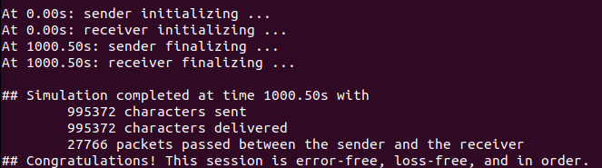
     - `./rdt_sim 1000 0.1 100 0.02 0 0 0`
        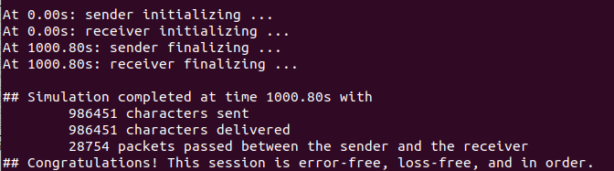  
     - `./rdt_sim 1000 0.1 100 0 0.02 0 0`
        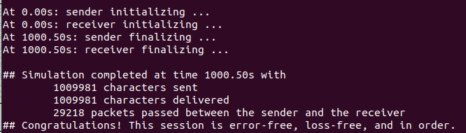 
     - `./rdt_sim 1000 0.1 100 0 0 0.02 0`
        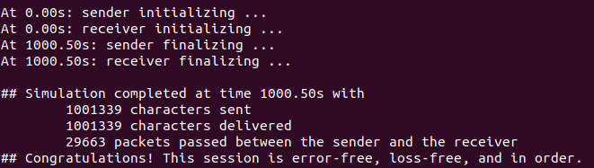 
     - `./rdt_sim 1000 0.1 100 0.02 0.02 0.02 0`
        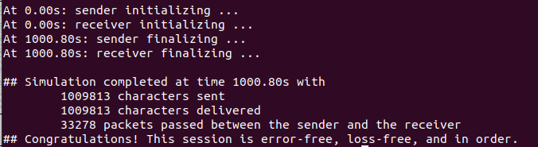 
     - `./rdt_sim 1000 0.1 100 0.15 0.15 0.15 0`
        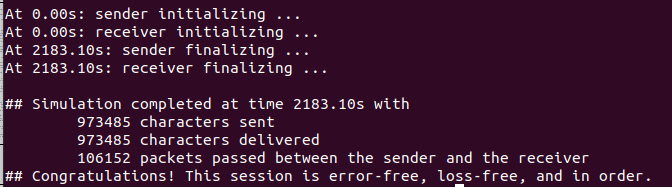 
     - `./rdt_sim 1000 0.1 100 0.3 0.3 0.3 0`
         
   - 采用receiver滑动窗口宽度为10测试
     - `./rdt_sim 1000 0.1 100 0 0 0 0`  
        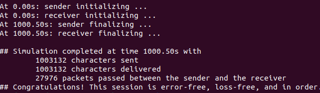
     - `./rdt_sim 1000 0.1 100 0.02 0 0 0`
        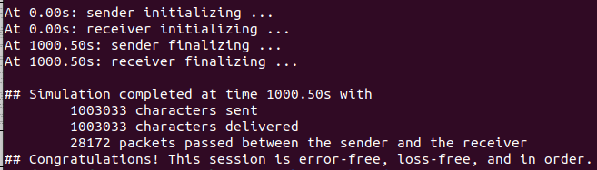  
     - `./rdt_sim 1000 0.1 100 0 0.02 0 0`
         
     - `./rdt_sim 1000 0.1 100 0 0 0.02 0`
        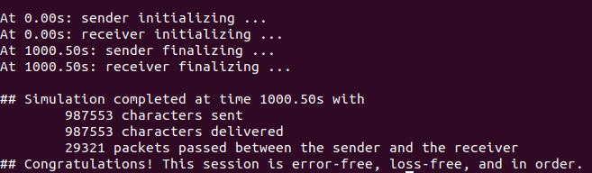 
     - `./rdt_sim 1000 0.1 100 0.02 0.02 0.02 0`
        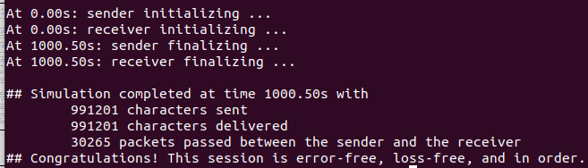 
     - `./rdt_sim 1000 0.1 100 0.15 0.15 0.15 0`
        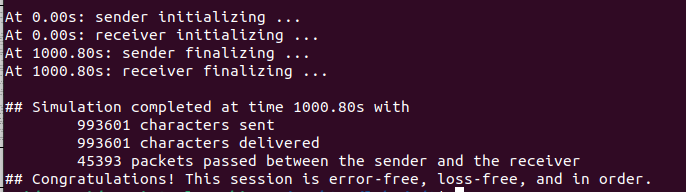 
     - `./rdt_sim 1000 0.1 100 0.3 0.3 0.3 0`
        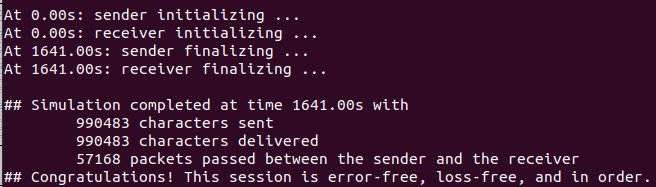 
   - 简要分析:
     - 朴素的GBN实现比参考值发的包要偏多, 即因为其对乱序发包的接受能力很差
     - 当再receiver中实现滑动窗口之后, 可以将乱序收到的包提前保存, 无需再让sender不断地重复发包

5. 遇到的问题
   1. char类型为有符号的将256进制数拆分成不同的byte时要注意使用unsigned char进行存入取出
   2. 注意time的设置, 循环能够进入窗口进行发包时再设置: 如果缓存里面没有包, 设置时钟会导致无限循环  
   ``` C++
   void Sender_TimeoutMy() {
        /*think if not in loop*/
        // printf("sender timeout \n");
        /*resend all packets in window*/
        for(uint32_t start = window_start_idx; start <= window_end_idx && start < pkt_q.size(); start++) {
            if (window_start_idx == start)
                Sender_StartTimer(time_out);
            Sender_ToLowerLayer(&pkt_q[start]);
            mx_send = (start + 1) > mx_send ? start + 1 : mx_send;
        }
    } 
   ```
   3. receiver正好接收到想要的包 while循环中应当注意mx_rev(变量意为接收到的最大seqnumber)被多加了一次，退出循环时要减去
   4. checksum由short强转为u_int32_t, 封包与拆包时都应该做对应的转换
