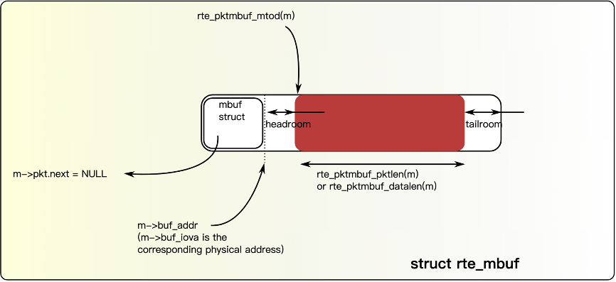
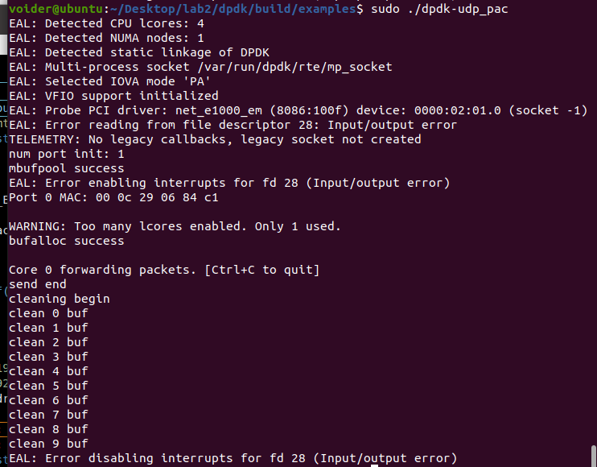
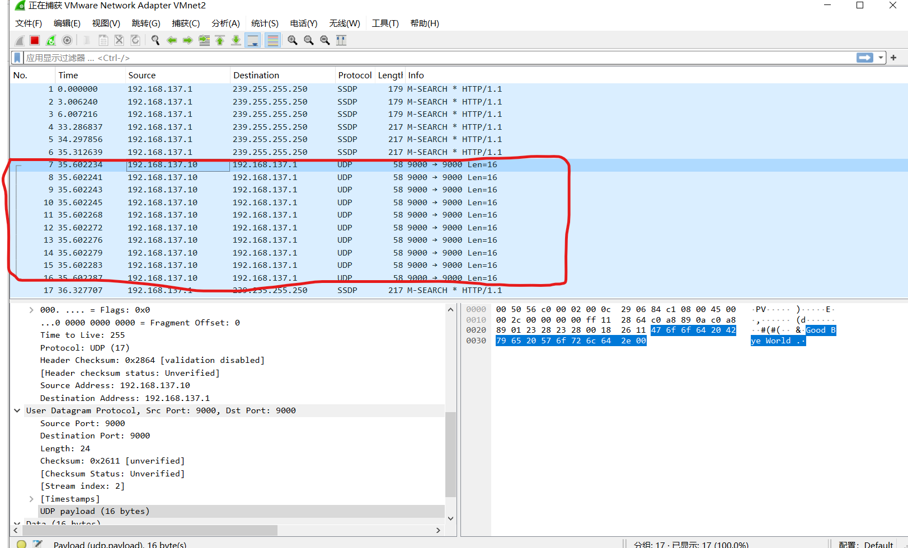
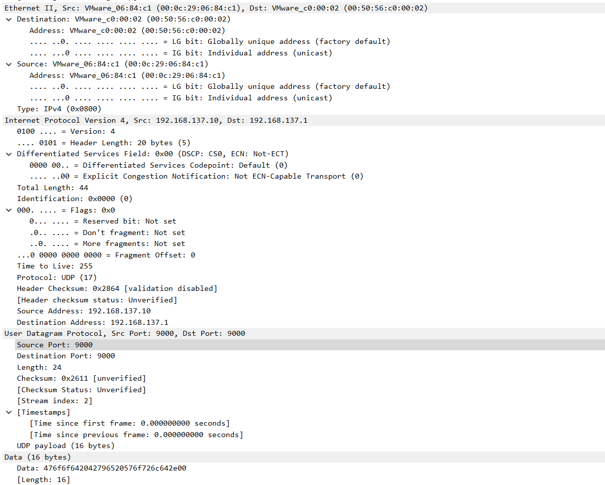
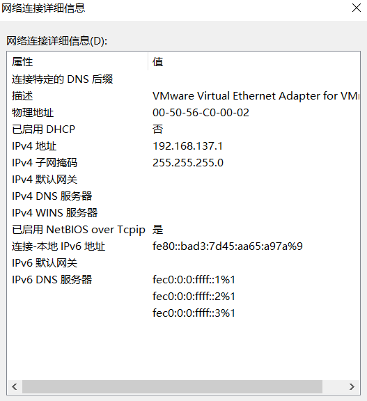
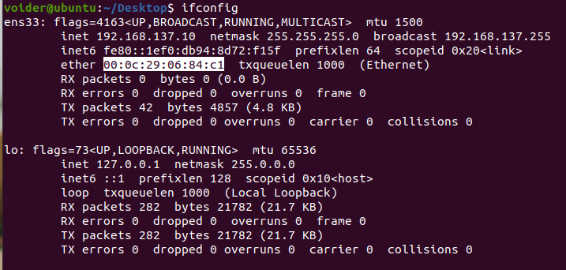

## Lab2  

### 问题回答  
1. 为什么要用大页  
    1. 一个地址可以对应更大的内存区域，数据包缓冲区占用的页面会减少，对应的TLB缓存条目也会减少，提升TLB HIT的概率；对于页表翻译来说，降低了页表的级数，从而降低虚拟地址翻译成物理地址的复杂性，提升查询页表的效率。  
2. Take examples/helloworld as an example, describe the execution flow of DPDK programs?  
    1. 入口参数是启动DPDK的命令行，对于HelloWorld这个实例，最需要的参数是“-c<core mask>”，线程掩码（core mask）指定了需要参与运行的线程（核）集合。
    2. 调用rte_eal_init，初始化基础运行环境，若初始化失败则报错。 其行为如下：配置初始化、内存(池)初始化、队列初始化、告警初始化、中断初始化、PCI初始化、定时器初始化、检测内存本地化、插件初始化、主线程初始化、轮训设备初始化、建立主从线程通道等.
    3. 多核运行初始化： RTE_LCORE_FOREACH_SLAVE（lcore_id）如名所示，遍历所有EAL指定可以使用的lcore，然后通过rte_eal_remote_launch在每个lcore上，启动被指定的线程。
    4. 运行函数lcore_hello。
    5. 主线程等待其他线程执行，并完成内存回收。
```c
/* Launch a function on lcore. 8< */
static int
lcore_hello(__rte_unused void *arg)
{
    unsigned lcore_id;
    lcore_id = rte_lcore_id();
    printf("hello from core %u\n", lcore_id);
    return 0;
}
/* >8 End of launching function on lcore. */
/* Initialization of Environment Abstraction Layer (EAL). 8< */
int
main(int argc, char **argv)
{
    int ret;
    unsigned lcore_id;
    ret = rte_eal_init(argc, argv);
    if (ret < 0)
        rte_panic("Cannot init EAL\n");
    /* >8 End of initialization of Environment Abstraction Layer */
    /* Launches the function on each lcore. 8< */
    RTE_LCORE_FOREACH_WORKER(lcore_id) {
        /* Simpler equivalent. 8< */
        rte_eal_remote_launch(lcore_hello, NULL, lcore_id);
        /* >8 End of simpler equivalent. */
    }
    /* call it on main lcore too */
    lcore_hello(NULL);
    /* >8 End of launching the function on each lcore. */
    rte_eal_mp_wait_lcore();
    /* clean up the EAL */
    rte_eal_cleanup();
    return 0;
}
```
3. Read the codes of examples/skelet on, describe DPDK APIs related to sending and receiving packet s.  
    主要代码如下所示  
   1. 调用rte_pktmbuf_pool_create函数实现对内存池的分配 参数解析: name为内存池名字，n为mbuf pool中的元素个数，cache size为单个核缓冲区大小，privsize为介于rte_mbuf和数据缓冲区之间的应用程序私有大小，与RTE_MBUF_PRIV_ALIGN对齐。
   ```c
   struct rte_mempool* rte_pktmbuf_pool_create	(const char* name, unsigned n, unsigned cache_size, uint16_t priv_size, uint16_t data_room_size, int socket_id)
   ```
   2. 发包与收包的函数接口 portid为初始化完成的port，queue_id为接收队列索引，rx(tx)_pkts为指向rte_mbuf的指针数组的指针，需要足够大作为包的缓存,nb_pkts为最大收(发)包数量，在示例中使用了burst模式，即收/发包数量为32个。一次性收多个包可以减少IO频率，同时也降低了内存访问的次数。
   ```c
   static inline uint16_t rte_eth_rx_burst(uint8_t port_id, uint16_t queue_id, struct rte_mbuf **rx_pkts, const uint16_t nb_pkts)
   static inline uint16_t rte_eth_tx_burst(uint8_t port_id, uint16_t queue_id, struct rte_mbuf **tx_pkts, uint16_t nb_pkts)
   ```
   
```c
mbuf_pool = rte_pktmbuf_pool_create("MBUF_POOL"，NUM_MBUFS * nb_ports, MBUF_CACHE_SIZE, 0, RTE_MBUF_DEFAULT_BUF_SIZE, rte_socket_id());

const uint16_t nb_rx = rte_eth_rx_burst(port, 0, bufs, BURST_SIZE);

if (unlikely(nb_rx == 0))
    continue;
/* Send burst of TX packets, to second port of pair. */
const uint16_t nb_tx = rte_eth_tx_burst(port ^ 1, 0, bufs, nb_rx);
```  

4. Describe the data structure of 'rte_mbuf'.  
   1. 数据结构示意图如下所示 
      - mbuf头部包含一个指针pkt.next，指向下一个rte_mbuf的位置
      - headroom是头部与用户自定义包之间的一个空袭，存储控制信息、事件等，buff_addr指向该位置的起始端
      - headroom与tailroom之间的空间为实际数据，长度需要指定pkt.data_len == pkt.pkt_len，pkt.data指向该位置的头部
      - 最后是tailroom，预留剩余空间，便于拆包
    
   2. 下面是函数/元素与对应位置关系  

        | 元素/func | intro |
        | :-----: | :----: |
        | m       | 首部，即mbuf结构体|
        |mpool    | mbuf所在内存池|
        | m->buf_addr | headroom起始地址 |
        | m->data_off | data起始地址相对于buf_addr的偏移 |
        | m->buf_len  | mbuf和priv之后内存的长度，包括headroom |
        | m->data_len | 整个mbuf链的data总长度  |
        | rte_pktmbuf_mtod(m) | 数据起始地址 |
        | m->buf_addr+m->data_off | 数据起始地址 |
        | rte_pktmbuf_data_len(m) | 同m->data_len |
        | rte_pktmbuf_pkt_len(m) | 同m->pkt_len |
        | rte_pktmbuf_headroom(m) | headroom长度 |
        | rte_pktmbuf_tailroom(m) | 尾部剩余空间长度 |
        | rte_pktmbuf_data_room_size(mpool) | 同m->buf_len，包括headeroom |

###  检验正确性 版本为23.11

#### 程序的编译与运行  
```shell
cd dpdk
sudo meson -D examples=udp_pac build
cd build
sudo ninja install
cd examples
sudo ./dpdk-udp_pac
```

#### 运行截图  
通过wireshark监听来自虚拟机的UDP包，将其解析后如下图所示  

  
报文解析如下：  

主机与虚拟机网卡信息如下：可以看出mac地址，ip地址，udp端口号都是一致的，ttl，protocol，data，length都是正确的  
   


### 参考链接  
<https://blog.csdn.net/qq_20817327/article/details/113871877>  
<https://blog.csdn.net/yaochuh/article/details/88530071>  
<https://doc.dpdk.org/api/>  
<https://zhuanlan.zhihu.com/p/498098074>
深入浅出dpdk第一章