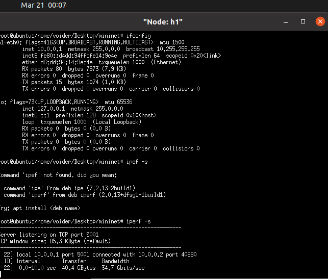
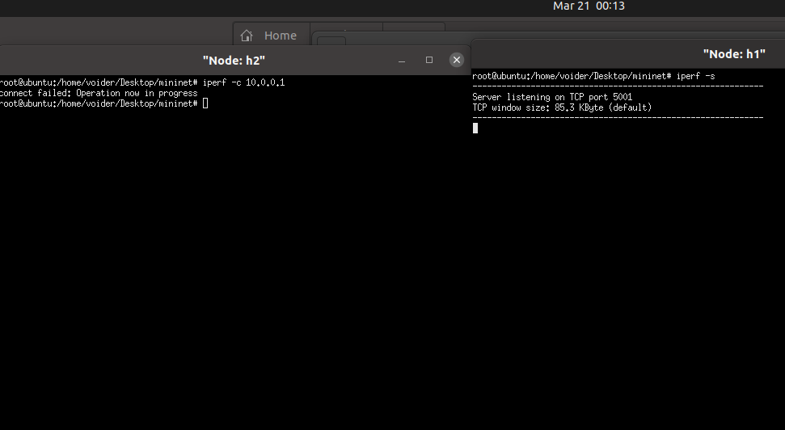
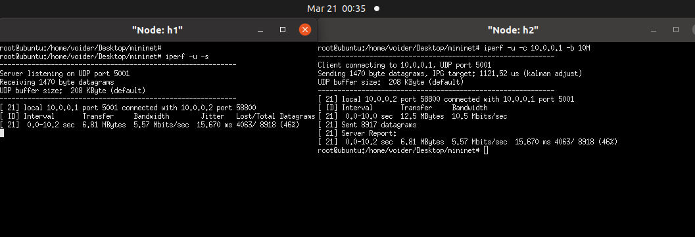
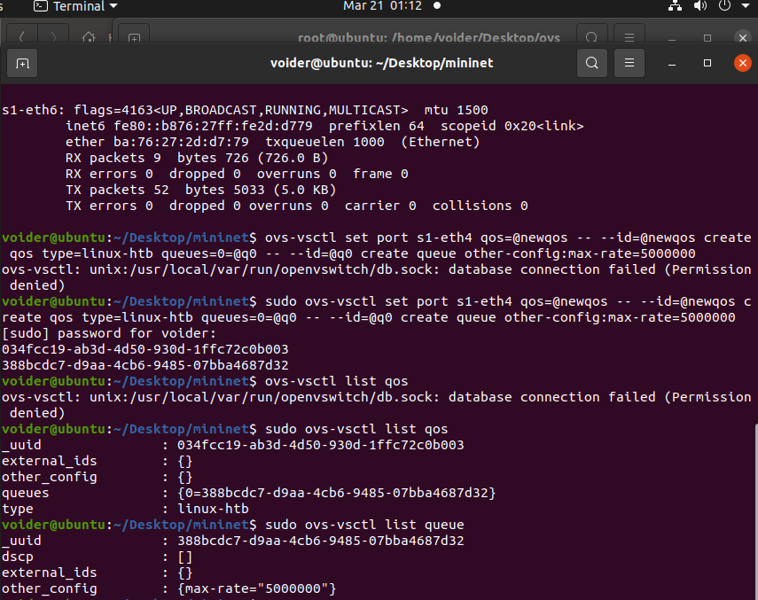
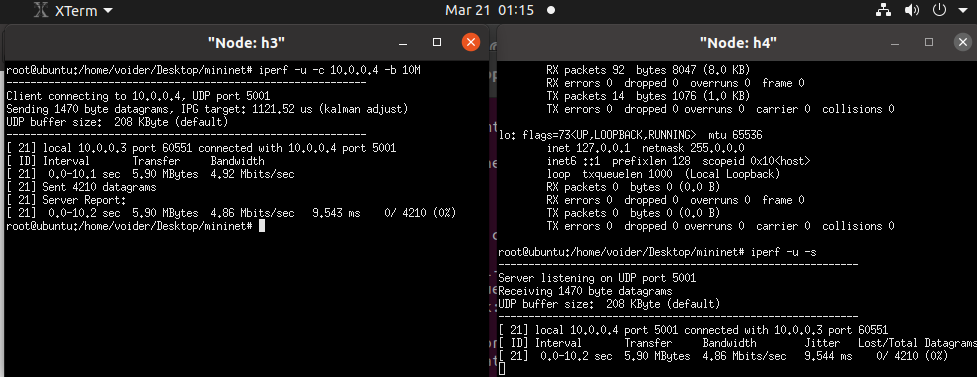
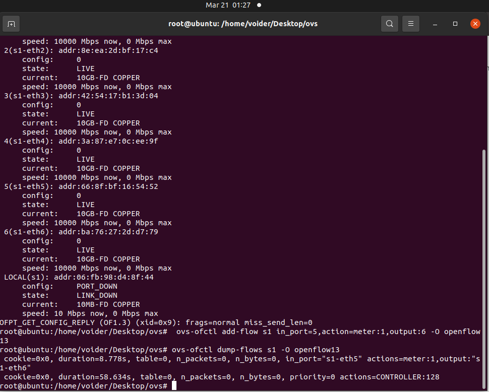
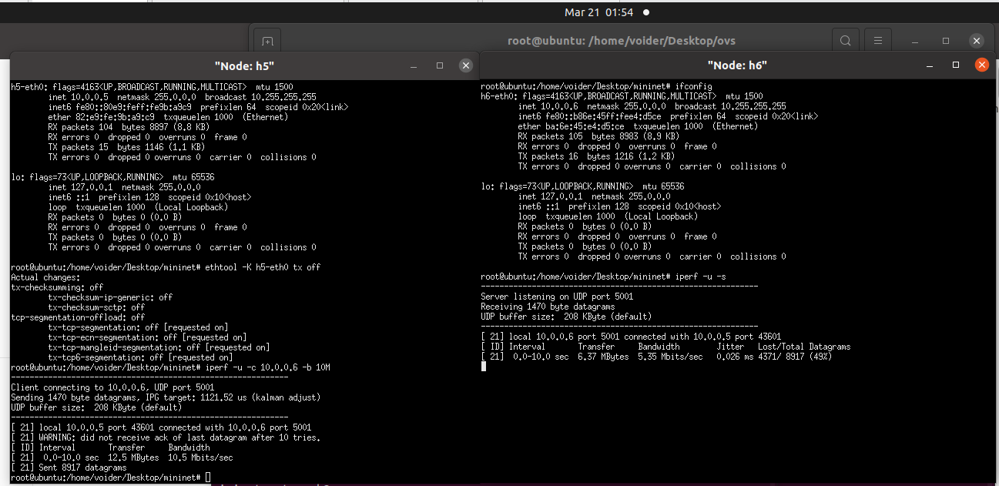
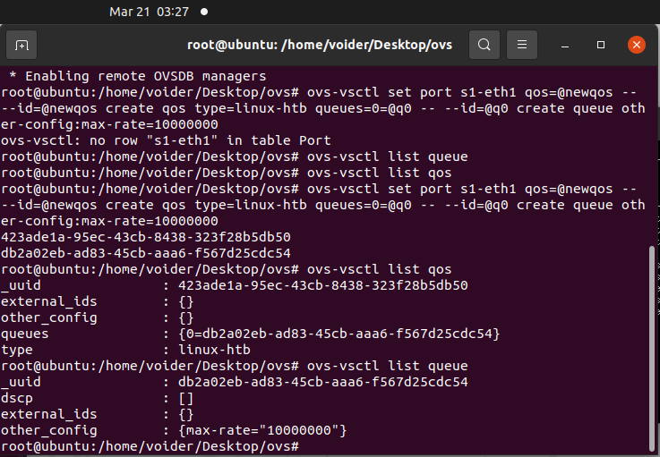
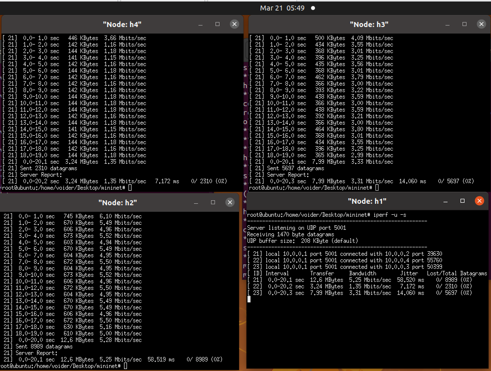

### Lab3

- Part1 搭建网络拓扑
  - 连通性测试
  - 如图 
  使用ifconfig获得node1 IP地址, 然后node2向node1发包, 进行连通性测试, 通信成功
  - 
  -  
- part2 准入控制
  - 建立准入规则 
  - node2向node1发包, 被拒收(包全部被丢弃) 
- part3 三种限速方式
  - 网卡限速(Linux内核中接收数据包使用的方法叫策略(policing)用于限制网卡上接收分组(ingress)的速率，当速率超过了配置速率，就简单的把数据包丢弃。)
    - 使用ovs对node1-2网卡进行限速 
    - node2向node1发包后的结果 
    - 结果:  
 
    |发送/收到(bytes)|   丢包率(%)    |  Jitter(ms) |  发送/接收带宽(Mbits/sec)  |
    |--             |       --       |   --------  | ------ |
    |12.5M/6.81M    |4063/ 8918 (46%)|   15.670    |  10.5/5.57  |
  - 队列限速(Linux可以将网络数据包缓存起来,然后根据用戶的设置,在尽量不中断连接(如tcp)的前提下来平滑网络流量。内核通过某个网络接口发送数据包,它都需要按照这个接口的队列规则把数据包加入队列)
    - 为node4网卡创建队列, 指定最大速率 
    - node3向node4发送包 
    - 结果  
  
    | 发送/接收(bytes) |丢包率(%)| Jitter(ms) | 发送/接收带宽(Mbbits/sec) |
    |---|----|---|---|
    |5.90M/5.90M| 0/4210 (0%) | 9.544ms | 4.92/4.86 |
  - Meter表限速
    - 先按要求进行配置 
    - #### question1 尝试理解Line19,20两条指令，指出每条指令的具体工作是什么，并逐个分析其中各个参数的具体含义
      - 第一条指令向交换机s1中添加流表项
        - add-flow s1 在s1中添加
        - in_port=5 表示这个流表项匹配进入s1的第5端口(s1-eth5)的数据包
        - action=meter:1 指定匹配到的数据包应用Meter1的规则
        - output:6 匹配到的数据包将被发送到交换机的第6端口(s1-eth6)
        - -O openflow13: 指定使用 OpenFlow 1.3版本协议进行操作
      - 第二条用于显示交换机s1上的所有流表项
        - dump-flows 用于导出交换机上的流表项
        - s1 指定要查看的交换机的名称
        - -O openflow13 指定使用OpenFlow 1.3版本协议进行操作
    - 发包测试
      - 
 
      |发送/接收(bytes)|丢包率(%)|Jitter(ms)|发送/接收带宽(Mbits/Sec)|
      |--|--|--|--|
      |12.5M/6.37M|4371/8917 (49%)|0.026|10.5/5.35|
    - #### Question2到这里，你已经完成了三种限速方式的实验，并获得了三组测试数据，请你就三组数据中的带宽、抖动和丢包率等参数，对三种限速方式进行横向比较，并适当地分析原因
      - 接收端数据对比
 
      |限速方式|接收带宽(Mbits/Sec)|丢包率(%)|Jitter(ms)|
      |--|--|--|--|
      |网卡限速|5.57|46%|15.670|
      |队列限速|4.86|0|9.544|
      |Meter表限速|5.35|49%|0.026|
      - 队列限速带宽限制效果好于网卡限速和Meter表限速: 队列限制确保数据包以有序和可预测的方式进行处理和传输——在发送端就已经做好了限制, 网卡限速与Meter表限速对于突发流量可能会出现带宽超出限制的情况
      - 由于维护数据缓存, 队列限速会把没来得及发送的数据缓存在队列里, 不会简单地丢弃, 另外两种策略都会丢弃数据包
      - Meter表限速抖动最小: Meter表可以根据实时流量情况调整其策略, 以更好地适应网络负载的变化。网卡在硬件上固定速率, 方式粗放; 队列限制也会出现队列拥塞的情况, 或者由于调度的问题, 产生发送速率的波动。
- Part4 拓展与应用
  - 场景模拟
    - 为s1-eth1队列限速10Mbits/sec 
    - node2-4同时发送 稳定后平均带宽为3.43 3.46 3.30 Mbits/sec 
    - 三者速率几乎相同, 可见三者是平等关系, 且三者带宽之和约等于node1限制的带宽——node1(Server)带宽被完全占用, 平均分配给三个client
  - Qos设计
    - 利用队列设置中的min-rate保证node2-3的速率 同时也使用max-rate选项保证node4带宽尽量多
    - 首先设置node1最大接收带宽为10Mbits/sec 然后创造两个限速队列 通过流表配置到node2-3
    - 运行指令
    - 
    ```C
    ovs-vsctl set port s1-eth1 qos=@newqos -- --id=@newqos create qos \ 
    type=linux-htb other-config:max-rate=10000000 \ 
    other-config:min-rate=10000000 queues=1=@q1,2=@q2 -- \
    --id=@q1 create queue other-config:min-rate=5100000 \
    other-config:max-rate=5400000 -- \
    --id=@q2 create queue other-config:min-rate=3100000 \
    other-config:max-rate=3400000
    
    ovs-ofctl add-flow s1 in_port=2,action=set_queue:1,output:1 -O openflow13
    ovs-ofctl add-flow s1 in_port=3,action=set_queue:2,output:1 -O openflow13
    // 将两个最小值设置比5M 3M稍大 如果正好为这两个值的话会出现不能保证带宽的情况
    ``` 
    - 运行结果 能够满足要求 